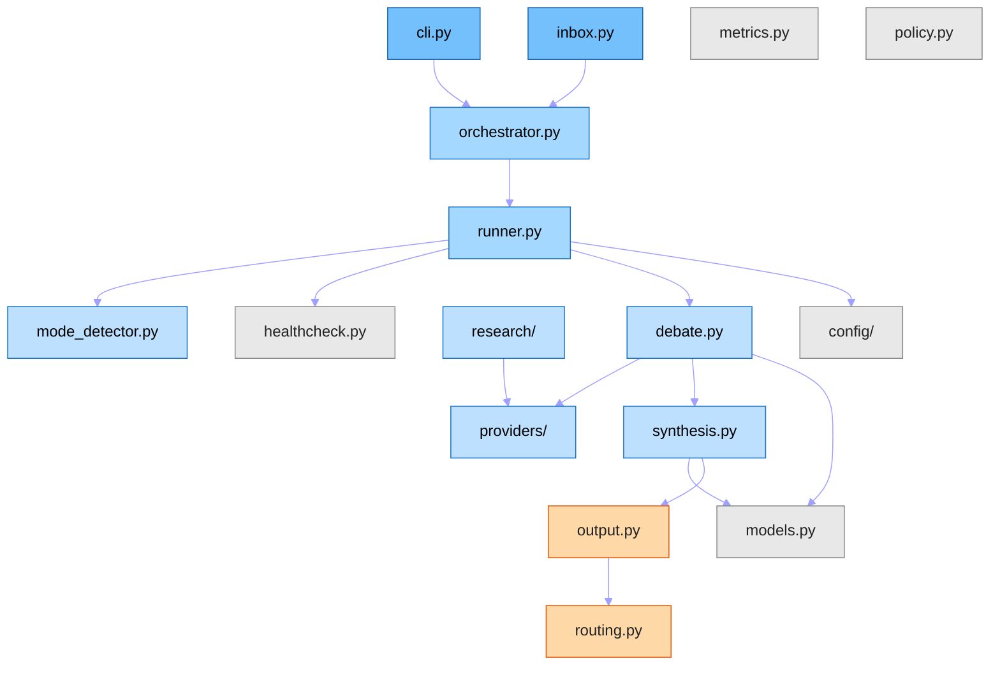
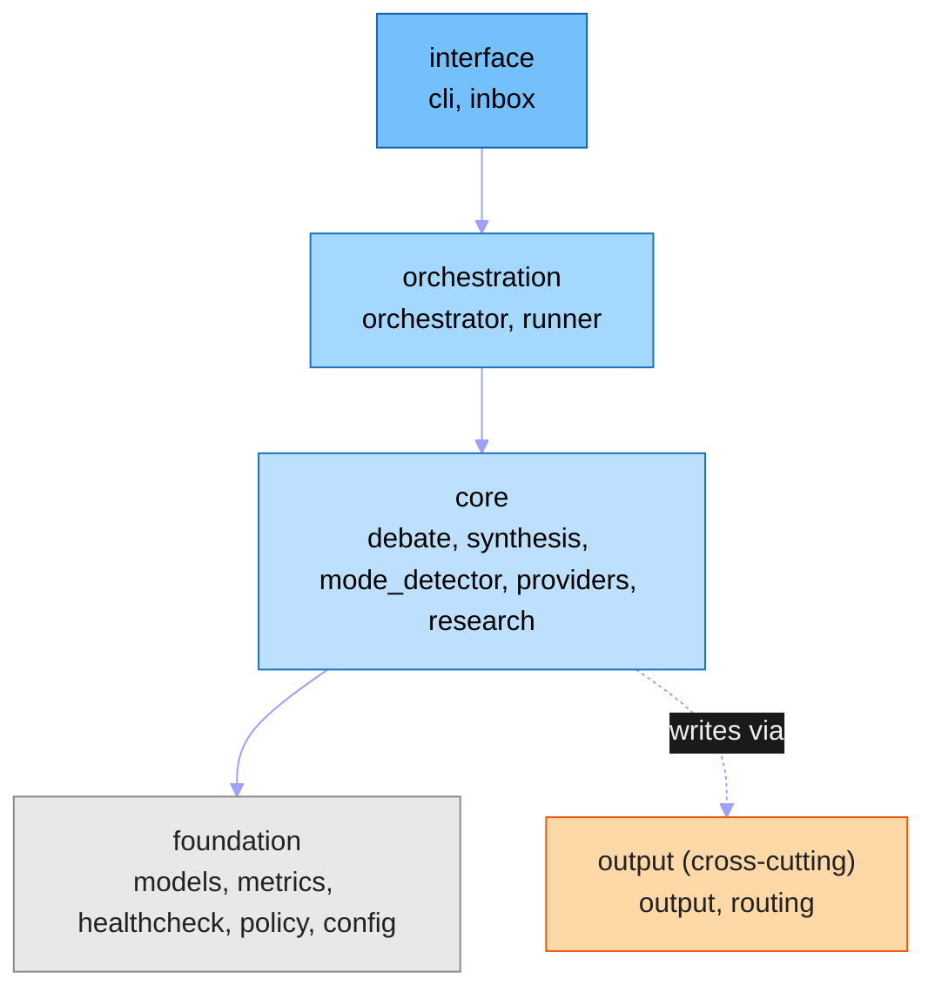

# Architecture — `ai-council`

> Living document. Updated after structural changes.
> Last updated: `2026-07-02` (`Epic A output subsystem: ADR-10 return_dir routing + first-class minority-report artifact (#13/#15); reviewed Folder Governance end-to-end`)

## Purpose [CORE]

`ai-council` is a multi-model AI debate and research CLI with four operating modes (pick, ideas, judge, research). It coordinates a configurable panel of AI models (Anthropic, OpenAI, Google, xAI, DeepSeek) through structured rounds of parallel debate and blind-vote critique, synthesizes a final verdict from a non-participating synthesizer, and routes transcripts to both its operational archive and target project directories. Within the `Dev/` ecosystem it is the primary mechanism for producing Architecture Decision Records: Council debate produces a verdict; that verdict is authored into an ADR that is ratified and distributed by `.dev-knowledge` to all downstream repos.

---

## Codemap [CORE]

> **Codemap form.** The codemap generator shipped 2026-05-22 (ADR-51 amendment); generator adoption is **opt-in** and ai-council maintains this block by hand. The Mermaid graph shows the module dependency structure; per-module responsibilities follow in the table below.

<!-- CODEMAP:START -->

<!-- hand-authored Mermaid codemap per ADR-51 amendment 2026-05-22; not generator-managed -->
<!-- CODEMAP:END -->

**Module responsibilities** (semantic complement to the structural graph):

| Module | Layer | Responsibility |
|--------|-------|----------------|
| `cli.py` | interface | CLI entry; Click args → RunRequest; health-check gate |
| `inbox.py` | interface | File-based batch input; YAML frontmatter; archive |
| `orchestrator.py` | orchestration | CouncilRunner; debate lifecycle coordinator |
| `runner.py` | orchestration | Panel selection; provider init; mode resolution |
| `debate.py` | core | Parallel debate rounds; blind-vote critique; retry |
| `synthesis.py` | core | Final synthesis; transcript assembly; DebateResult build |
| `mode_detector.py` | core | LLM-based question classification (pick/ideas/judge) |
| `providers/` | core | 5 debate-provider implementations: `base.py` (AIProvider ABC), `anthropic.py`, `openai_provider.py`, `gemini.py`, `xai.py`, `deepseek.py` |
| `research/` | core | Research-mode subsystem (isolated code path): `runner.py`, `provider.py` (ABC), `cache.py`, `merger.py`, `models.py`, `display.py`, `output.py`, `providers/` (5 research providers) |
| `output.py` | output | Rich console render + markdown archive write |
| `routing.py` | output | TargetResolver; secondary transcript routing (ADR-43) |
| `models.py` | foundation | Pure dataclasses; all shared data shapes; no logic |
| `metrics.py` | foundation | Token-count + cost tracking per provider call |
| `healthcheck.py` | foundation | Provider health checks; startup gate |
| `policy.py` | foundation | RunPolicy; retry backoff spec |
| `config/` | foundation | `config_loader.py` (type-safe YAML → dataclass; appConfig singleton) + `settings.yaml` (single config source of truth: models, prompts, personas) |

---

## Layer Boundaries & Invariants [CORE]

### Layer model

Four layers in dependency order (interface → orchestration → core → foundation). `output` is a cross-cutting concern that writes results produced by `core`.



**Enforcement tool:** Convention + code review. No automated import-linter at current scale (no Tach).  
**Config file:** N/A  
**Where enforced:** Code review; `scripts/check.ps1` (pytest + mypy + ruff)

### Module-to-layer assignment

| Layer | Modules |
|-------|---------|
| `interface` | `cli.py`, `inbox.py` |
| `orchestration` | `orchestrator.py`, `runner.py` |
| `core` | `debate.py`, `synthesis.py`, `mode_detector.py`, `providers/`, `research/` |
| `foundation` | `models.py`, `metrics.py`, `healthcheck.py`, `policy.py`, `config/` |
| `output` (cross-cutting) | `output.py`, `routing.py` |

Utility-exemption modules (importable from any layer): none.

### Invariants

1. `models.py` contains no logic — pure dataclasses only; the sole source of shared data shapes across all layers.
2. `cli.py` performs no business logic — it translates CLI arguments into a `RunRequest` and immediately delegates to `CouncilRunner`.
3. Config strings (model names, prompts, personas, cost rates) are defined solely in `config/settings.yaml` — none hard-coded in Python source.
4. `_anonymize_responses()` in `debate.py` is the sole implementation of blind voting (ADR-03); its shuffle order is part of the contract and must not be altered without an ADR.
5. The synthesizer is a non-participating observer — it receives the full transcript but does not vote in debate rounds, and must not be a member of the debating panel.
6. The research subsystem (`research/`) is an isolated code path — features added to interactive debate mode are not automatically available to research mode; they must be explicitly mirrored.
7. All mutable session state flows through `DebateResult` and `RunRequest` dataclasses — provider implementations are stateless between calls.

→ Related decisions: `docs/decisions/ADR-03-blind-voting.md`, `docs/decisions/ADR-04-mode-system.md`, `docs/decisions/ADR-05-research-integration.md`, `docs/decisions/ADR-07-dual-output-paths.md`

---

## Data Flow

End-to-end debate pipeline:

```
1. Input arrives via CLI (`council "question"`) or inbox file
       |
2. mode_detector.py classifies the question (pick / ideas / judge / research)
       |
3. runner.py selects panel + resolves synthesizer; healthcheck.py gates startup
       |
4. debate.py runs Round 1: parallel provider calls; anonymizes + shuffles responses (ADR-03)
       |
5. debate.py runs critique rounds: each panellist sees anonymized responses from prior round
       |
6. synthesis.py calls non-participating synthesizer on full transcript; builds DebateResult
       |
7. output.py writes Rich console display + markdown archive → ai-council/output/
       |
8. routing.py optionally copies curated transcript to target project dir (ADR-43)
```

Research mode branches at step 2: `research/runner.py` → cache check → parallel provider calls → `research/merger.py` → `research/output.py`. If fewer than 3 providers succeed, run continues but exits with code 3 and an alarm banner (ADR-08).

---

## Key Design Decisions

- **Panel system**: `determine_panel()` in `runner.py`; `--models` wins over `--full`/`--lite` wins over default. Full 5-model panel is the default; `--lite` uses 3-model panel; `--full` is a no-op kept for backward compat.
- **Blind voting**: `_anonymize_responses()` shuffles + labels as "Proposal A/B/C"; provider names hidden during critique rounds (ADR-03).
- **Non-participating synthesizer**: `pick_synthesizer()` picks a model outside the panel; default `gemini`; falls back with `is_participant=True` if none available.
- **Config source of truth**: All model strings, timeouts, max_tokens, prompts, personas in `config/settings.yaml` — none hard-coded.
- **Graceful degradation**: Round 2+ all-fail → `DebateOutcome(degraded=True)` with partial rounds; round 1 all-fail → `RuntimeError`.
- **Research mode**: Separate code path — bypasses debate pipeline entirely; runs parallel providers via `asyncio.wait()` + progressive display; merges results; summarizes via LLM; file cache under `~/.ai-council/research_cache/` with 7-day TTL.

---

## Transcript Routing

Opt-in, per-invocation mirroring of debate transcripts to named target project directories (ADR-43).

**Two-layer model:**
- **Names** (e.g., `.dev-knowledge`) come from frontmatter or `--target-project` flag — dynamic per invocation.
- **Ecosystem root** (`dev_root`) declared once in `config/settings.yaml`; paths computed as `<dev_root>/<name>/docs/decisions/transcripts/`.

**Behavior:**
- Canonical `output/` always written first (hard requirement; failure is hard error).
- Mirror writes are best-effort: failure logs warning, canonical never affected.
- Unknown target name → `RoutingError` at parse time (before debate runs), listing known names.
- No `target-project` → canonical only, unchanged behavior.

**Key files:** `src/ai_council/routing.py` (TargetResolver + RoutingError), `config/settings.yaml` (dev_root + target_projects list).

---

## Debate Modes

| Mode | Aliases | Default rounds | Purpose |
|------|---------|---------------|---------|
| `pick` | `p`, `pick`, `d`, `decide` | 2 | Choose between options **(default)** |
| `ideas` | `i`, `ideas` | 1 | Brainstorm; surface unknowns and divergent ideas |
| `judge` | `j`, `judge` | 2 | Evaluate a proposal or claim; get a verdict |
| `research` | `r`, `research` | — | Multi-source web research with citations |

- `pick` uses `prompts.initial`/`prompts.critique`/`prompts.synthesis` from `settings.yaml` (backward compat).
- `ideas`/`judge` use per-mode blocks in the `modes:` section of `settings.yaml`.
- Mode auto-detected from question text via cheap LLM call (5s interactive confirm); resolved by `resolve_mode()` in `config_loader.py`.
- `research` routes to `src/ai_council/research/runner.py:run_research()` before the debate pipeline.

---

## Research Providers

| Provider | Env var | Default | `--deep` only | Notes |
|----------|---------|---------|--------------|-------|
| `perplexity` | `PERPLEXITY_API_KEY` | yes | no | sonar-pro; OpenAI-compatible |
| `grok` | `XAI_API_KEY` | yes | no | grok-4.20-reasoning; Responses API; unique X/Twitter signal |
| `openai_mini` | `OPENAI_API_KEY` | yes | no | o4-mini-deep-research; Responses API |
| `gemini` | `GEMINI_API_KEY` | yes | no | Interactions API; autonomous agent; ~5-20 min |
| `openai_deep` | `OPENAI_API_KEY` | no | yes | o3-deep-research; ~45 min timeout |

Missing API keys are silently skipped — remaining providers still run.

---

## Folder Governance

| Folder | Contents |
|--------|---------|
| `src/` | All Python source code |
| `tests/` | All tests |
| `config/` | `settings.yaml` and `config_loader.py` |
| `scripts/` | `check.ps1` and utility scripts |
| `protocols/` | Outward-facing invocation specs (SCREAMING_SNAKE): `COUNCIL_QUESTION_GUIDE.md`, `SYNTHESIS_QUALITY_RUBRIC.md` — ai-council's delegation surface, mirroring the hub's `protocols/` (ADR-09, local) |
| `docs/` | `decisions/` (ADRs + `transcripts/`), `audits/` (reports; pre-ADR-34 in `audits/archive/legacy/`), `archive/` — ADR-60 child-repo taxonomy (no `handoffs/`; those centralize in `.dev-knowledge`). Invocation specs live in `protocols/`, not here (ADR-09) |
| `output/` | Gitignored; debate transcripts, research reports, and `council-minority-*` dissent artifacts (#15). Canonical write; `--return-dir` additionally routes a copy (ADR-10, #13) |
| `council_inbox/` | Gitignored; drop `.md` files for batch processing |
| `LESSONS.md` | Repo-local lessons (append-only; at repo root) |

Do not create files outside these directories without updating this section.

---

## Inbox File Detection

`--inbox` processes files from two sources. Filename conventions differ — this is authoritative:

**1. `council_inbox/*.md` (primary inbox)** — `scan_inbox()` in `src/ai_council/inbox.py`
- Any `.md` file is picked up. No filename token or frontmatter required.
- Directory configured at `inbox.dir` in `settings.yaml` (default `./council_inbox`).
- Processed oldest-first by mtime.

**2. `~/Downloads/*.md` (opt-in pre-scan)** — `scan_downloads_folder()` in `src/ai_council/inbox.py`
- Picked up if **either**: (a) filename stem contains `council` (case-insensitive); **or** (b) YAML frontmatter contains any key in `inbox.council_frontmatter_keys` (default: `mode`, `rounds`, `models`, `synthesizer`, `full`, `target-project`).
- Files matching neither condition are silently ignored.
- Malformed YAML frontmatter is logged; file is skipped unless it already qualified by filename.
- Toggle via `inbox.scan_downloads`; directory via `inbox.downloads_dir`.

**Common to both:** Processed files move to `council_inbox/archive/` with `YYYY-MM-DDTHHMM_` prefix (or `FAILED_<timestamp>_` on failure). Prefixes are stripped from the slug used for output filenames via `clean_slug()`.

---

## Key conventions

- **Naming.** snake_case Python; kebab-case markdown; `ADR-NN-topic.md` for decisions (ADR-34); Council CLI output `council-out-YYYYMMDD-HHMMSS-topic.md`; ALL-CAPS for top-level governance markdown.
- **Append-only files.** `LESSONS.md` — never edit old entries (ADR-29). `JOURNAL.md` — newest-first prepend.
- **Immutable dated artifacts.** ADRs, transcripts, audits — supersede via a new file or in-file marker, never edit in place.
- **Config as source of truth.** Model strings, prompts, personas, timeouts, cost rates live solely in `config/settings.yaml` — none hard-coded (Invariant 3).
- **Layer discipline.** interface → orchestration → core → foundation; `output` is cross-cutting. `models.py` is logic-free; `cli.py` does no business logic.

---

## Authority and governance

`ai-council` is a **tool repo** governed by `.dev-knowledge` (Layer-2 binding authority, ADR-31). It owns its local tool-design ADRs (`docs/decisions/ADR-01…08`) and conforms to ecosystem ADRs (naming, file lifecycle, the seven-file canonical baseline ADR-38 A6).

- **Conformance:** verified out-of-band, read-only, by `.dev-knowledge/scripts/audit.py` against the canonical standard. `.dev-knowledge` never writes here (Layer-2 invariant, ADR-28).
- **Decision flow:** Council debate (this tool) → verdict → ADR authored + ratified by `.dev-knowledge` → distributed to downstream repos. Local ADRs cover only this tool's internal design.
- **Cross-domain split (ADR-67):** the process spec lives in `.dev-knowledge`; the `/council-question` template + gate + `council.return_dir` I/O are this repo's to implement (see `BACKLOG.md`).

---

## Validators and enforcement

- **`.\scripts\check.ps1`** — the pre-merge gate: `pytest` + `mypy` + `ruff`. Run before every merge (CLAUDE §5); not wired to pre-commit.
- **`tests/`** — pytest unit + integration suites. Unit suite (no API keys): `pytest tests/ -m "not integration and not envcheck"`.
- **Pre-commit:** `normalize-headers` (`scripts/normalize_headers.py`) — dated-log header normalization in `LESSONS.md` / `JOURNAL.md`.
- **External conformance (read-only):** `.dev-knowledge/scripts/audit.py` — seven-file canonical baseline + structural spine (ADR-38 A6); manual `run`, no commit gating here.

---

## Governing ADRs

- **Local** (`docs/decisions/`): ADR-01 synthesizer selection · ADR-02 panel composition · ADR-03 blind voting · ADR-04 mode system · ADR-05 research integration · ADR-06 cost optimization · ADR-07 dual output paths (superseded by ADR-43) · ADR-08 research degradation alarm · ADR-09 protocols/ invocation surface · ADR-10 output routing.
- **Ecosystem** (`.dev-knowledge/docs/decisions/`): ADR-29 (append-only LESSONS) · ADR-34 (naming) · ADR-38 (namespace + A6 seven-file baseline) · ADR-42 (handoffs centralized) · ADR-43 (transcript routing) · ADR-51 (ARCHITECTURE convention) · ADR-53 (CLAUDE.md) · ADR-59 (visual pattern) · ADR-60 (docs taxonomy) · ADR-67 (Council process operationalization).

---

**Maintained by:** Rob
